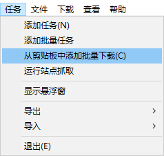

# zxzj spider
Crawl poster and mp4 from zxzj----从「在线之家」批量获取视频的下载链接

## Features
+ Easy use

## 用法简介（从源码）

- ```本项目适用于python3，如果不是使用virtualenv，注意将下面的pip命令换成pip3，python命令换成python3```

- ```windows, mac, linux(nstable)全平台支持```

- ```git clone https://github.com/umm233/1993s.git ```

- ```cd 1993s && pip install -r requirements.txt```

- 下载对应的`ChromeDriver`解压，命名为`chromedriver_win32`，放到文件夹`1993`内

- 将剧页面的 url 填到参数中：

  ```
  python crawler.py https://xxx/video/xxx-1-1.html
  ```

- 待程序运行完毕，会在目录下的`download-link.txt`中生成该剧的每集的下载链接

- 复制链接，使用 IDM 的批量下载`任务 -> 从剪切板中添加批量下载`

  


## 引用

- @[selenium](https://github.com/SeleniumHQ/selenium) is a browser automation framework and ecosystem.
- @[ChromeDriver](https://chromedriver.chromium.org/) is a separate executable that Selenium WebDriver uses to control Chrome. It is maintained by the Chromium team with help from WebDriver contributors.
